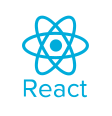
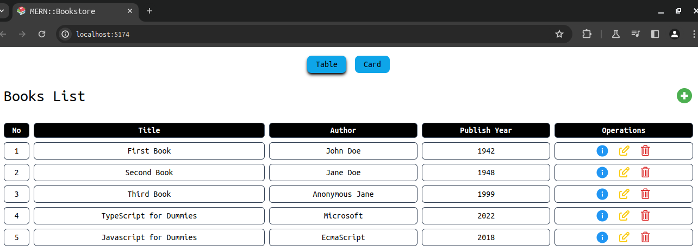

  

# MERN Stack

This repository contains a MERN (MongoDB, Express, React, Node.js) stack project. The MERN stack is a popular combination of technologies used for building full-stack web applications. It consists of MongoDB as the database, Express.js as the web application framework, React for building user interfaces, and Node.js as the runtime environment for server-side JavaScript.

## Installation

To get started with this project, follow the steps below:

1. Clone the repository: **`git clone <https://github.com/Diego-Girao/MERN-stack.git`**>
2. Navigate to the project directory: **`cd MERN-stack`**
3. Install the dependencies: **`npm install`**

Make sure you have MongoDB installed and running on your machine before proceeding with the installation.

## Usage

To start the server and access the application, follow these steps:

1. Start the server: **`npm start`**
2. Access the application in your browser at **`http://localhost:5555`**

Feel free to explore the different features and functionalities of the MERN stack project.

## Screenshots

## Technologies Used

The following technologies were used in the development of this project:

- **[MongoDB](https://www.mongodb.com/)**: A NoSQL database used for storing data in a JSON-like format.

- **[Express.js](https://expressjs.com/)**: A web application framework for building server-side applications and APIs.

- **[React](https://react.dev/)**: A JavaScript library for building user interfaces.

- **[Node.js](https://nodejs.org/)**: A runtime environment for executing JavaScript code on the server-side.

These technologies work together to create a seamless development experience and provide efficient solutions for building scalable web applications.

## Contributing

Contributions to this project are welcome! If you have any ideas or improvements, feel free to submit a pull request. Please make sure to follow the coding style and guidelines specified in the repository.

## License

This project is licensed under the MIT License. You can find the full license details in the [LICENSE](https://github.com/Diego-Girao/MERN-stack/blob/main/LICENSE) file.

## Acknowledgements

Your contributions are greatly appreciated!

If you find this project useful, please consider giving it a star on GitHub to show your support.
